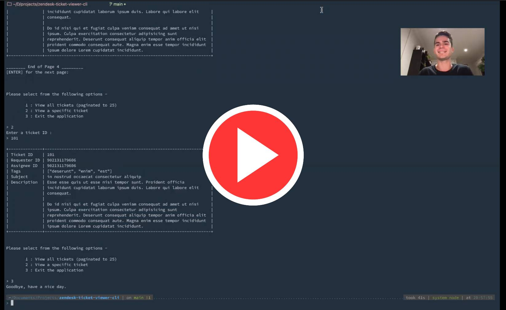

# zendesk-ticket-viewer-cli

> Zendesk Ticket Viewer CLI application for the Zendesk coding interview challenge

[](https://forthebadge.com)
[](https://forthebadge.com)

## Table of Contents

- [Requirements](#requirements)
- [Setup](#setup)
  - [Video](#video)
  - [Application installation and setup](#application-installation-and-setup)
- [Testing](#testing)
- [Tech Stack](#tech-stack)
- [Application Design Choices](#application-design-choices)
  - [Classes](#classes)
  - [Environment Variables](#environment-variables)
  - [ZendeskAPI Gem](#zendeskapi-gem)
  - [Minitest for testing](#minitest-for-testing)

## Requirements

This application has been tested on, and requires, `ruby 3.0.0`.

These tests were performed on MacOSX and Linux(Ubuntu).

Other ruby versions and application environments may not work or may cause unexpected behaviour.

## Setup

### Video

Click the image below to watch a short (3 minutes) video walking you through the setup for the application.

[](./docs/setup-video-and-walkthrough.mp4)
[](./docs/setup-video-and-walkthrough.mp4 "Video Title")

### Application installation and setup

Complete the following steps to get the application ready to run -

0. Ensure you have `ruby v3.0.0` or greater installed.
1. Clone this repository -
   - `git clone https://github.com/harrison-broadbent/zendesk-ticket-viewer-cli.git` (HTTPS)
   - `git clone git@github.com:harrison-broadbent/zendesk-ticket-viewer-cli.git` (SSH)
2. Enter into the project directory -
   - `cd zendesk-ticket-viewer-cli/`
3. OPTIONAL - Setup a new environment using rbenv
   - If you have issues with package conflicts / get weird errors, it's likely due to conflicting ruby versions.
   - More information available here - https://github.com/rbenv/rbenv
4. Install dependencies with bundle -
   - run `bundle install`
5. Watch `rake` tests fail -
   - A `rakefile` has been setup to automatically run tests for the project.
   - Run `rake` to check that there are no conflicts or weird errors.
6. Copy .env file to project root
   - I will have sent you a .env file containing secret information for the project.
   - Download that file and copy it into the project directory, ensuring it is named `.env` and not `env`.
   - Please contact me if there are issues, and for the purposes of this project I can commit them directly into this repository.
7. Re-run `rake` and watch the tests pass.
8. Run `ruby src/app.rb` from the root project directory to start the application.

## Testing

Testing is handled by the Minitest gem, and are located in the `tests/` directory.

A rakefile has been set up to automatically run the test suite.

Run the test suite with -

```
rake
```

- Ensure that application dependencies have been installed with `bundle` and that a `.env` file is present with appropriate information.

## Tech Stack

I chose to build this application using Ruby.

I have used it a little bit previously, but not extensively, and I decided that this was a good opportunity to learn it a bit better.

The following gems are also used in this application -

- [minitest](https://github.com/seattlerb/minitest) is used for unit testing.
- [rake](https://github.com/ruby/rake) is used to run the test suite.
- [terminal-table](https://github.com/tj/terminal-table) is used to display tickets in pretty tables.
- [zendesk_api](https://github.com/zendesk/zendesk_api_client_rb) is the official Zendesk Ruby client gem and is used to interface with the Zendesk API.
- [dotenv](https://github.com/bkeepers/dotenv) is used to load in environment variables from a `.env` file.
- [rbenv](https://github.com/rbenv/rbenv) is not directly required but was used to manage Ruby environments.

## Application Design Choices

### Classes

I broke the logic for the application into three distinct classes -

- `Application` - Handles most of the user-facing interactions and console I/O.
- `Tickets` - Handles interactions with the Zendesk API (via the `zendesk_api` gem), used to request single or multiple tickets.
- `Ticket` - Represents a single ticket, used to encapsulate data and display itself to the terminal.

Encapsulating the generic application logic, such as displaying messages and handling input, into its own `Application` class allowed me to streamline the actual execution of the program in `app.rb`. It also provides a centralized spot for the Application logic to live.

The `Tickets` class is responsible for all the logic for dealing with the Zendesk API. This class is also responsible for handling any errors that are raised, and communicating those errors to the user in a way that is approachable and easily understood. This class can easily be added to if additional functionality is required, such as adding or deleting tickets.

Finally, the `Ticket` class is responsible for encapsulating the data of a single ticket and also displaying that data to the terminal output. It extracts the relevant data from a `ZendeskAPI::Ticket`, in a way that is easily manipulated, and also provides a way to nicely display tickets via the `Ticket#display` method.

### Environment Variables

- I decided to store application secrets in environment variables (in the form of a `.env`) file, as a way to balance security and ease of use.
- It is pretty easy to send someone a `.env` file to place into the application, and as long as it is not committed to version control, ensures that application secrets are not publicly exposed.

### ZendeskAPI Gem

- I decided to make use of the first-party Ruby gem to interface with the Zendesk API.
- The gem is well maintained and documented and is used by many other projects.
- Using the gem also allows me to leverage the efforts and experience of a whole team of software engineers with extensive domain expertise.

### Minitest for testing

- There are a couple of well-regarded gems used for Ruby testing.
- Before this project, I had a little bit of experience testing Python applications (from my [LibgenAPI](https://github.com/harrison-broadbent/libgen-api)) project, but nothing in Ruby.
- After comparing the two main testing gems, Minitest and RSpec, I decided to use Minitest.
  - Minitest the default gem for testing in Rails, and is well-maintained on GitHub, which gave me confidence in the long-term support for the gem.
  - It also seemed simpler to get started with, as tests can be written in native Ruby.
